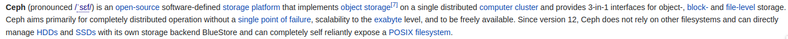
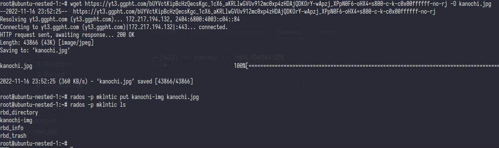
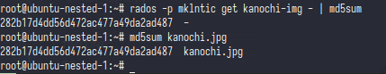
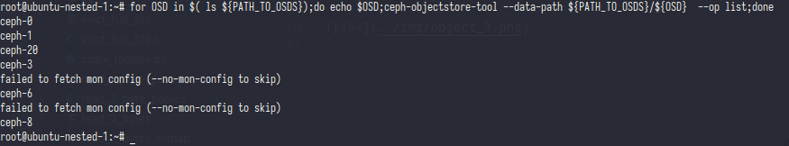
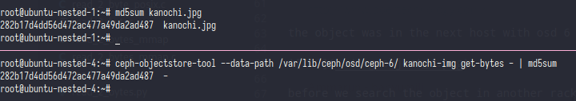
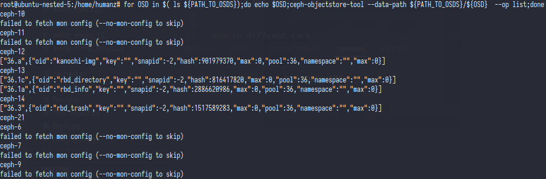
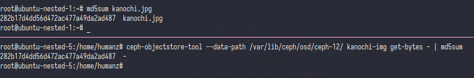

# Object
if you look at [wikipedia](https://en.wikipedia.org/wiki/Ceph_(software) ceph was storage based on object,but whats is actually object?



In ceph [academic paper](https://ceph.com/assets/pdfs/weil-rados-pdsw07.pdf) they said *object interface in which byte extents can be read or written (much like a file), as that was our initial requirement for Ceph. Data objects are replicated n ways across multiple OSDs to protect against node failures*

### So object is a file in osds and that file was come from file we uploaded into ceph (?)


yes object was file who come from uploaded file into ceph,but at some reason ceph creating object it's self

#### PoC
First i will upload my waifu image into ceph
- `wget https://yt3.ggpht.com/bUYVctKipBcHzQecsKgc_1cX6_aKRLlwGVUv912mc0xp4zHDAjQDKOrY-wApzj_XPpN0F6-oHX4=s800-c-k-c0x00ffffff-no-rj -O kanochi.jpg`
- `rados -p mklntic put kanochi-img kanochi.jpg`
- `rados -p mklntic ls`


the file was already uploaded into ceph with name kanochi-img,now i'm trying to verify that file.


- `rados -p mklntic get kanochi-img - | md5sum`
- `md5sum kanochi.jpg`

from the md5sum the object and file have same digiset


Now statment no 1 was valid,but how about statment no 2? what's the meaning ceph creating the object by ceph it's self?

Before we trying to proof statment no 2 better we proof the statment from ceph academic paper *Data objects are replicated n ways across multiple OSDs to protect against node failures*

Remember when we creating the ceph crush rule & ceph pool? if you forget it or not yet read it them GO TO [INIT_CEPH.md](../Init_ceph.md).

in that step we creating some crush rule with rack as replication/domain failure, after that we create the pool and set the size of pool.  
that size was size of object replication, if we set it into 3 that meaning our object will copy into 3 osds with **diffrent rack** because we create crush rule with rack as replication/domain failure **keep in mind** 

#### PoC
before we do the PoC pls back to [Topology](../Topology.md) and see the **osds tree**

in that osds tree i have 3 rack and earch rack have 3 hosts,2 hosts for have hdd_v2 and 1 hosts for ssd_v2.

And remember we put the file in mklntic pool which the file will saved into hdd_v2, ok now we can start the PoC

```
 -9           4.06847      rack rack01
 -3           0.04887          host ubuntu-nested-1
  0  hdd_v2   0.00980              osd.0                 up   1.00000  1.00000
  1  hdd_v2   0.00980              osd.1                 up   1.00000  1.00000
  8  hdd_v2   0.00980              osd.8                 up   1.00000  1.00000
 20  hdd_v2   0.01949              osd.20                up   1.00000  1.00000
-17           4.00000          host ubuntu-nested-4
  6  hdd_v2   1.00000              osd.6                 up   1.00000  1.00000
  7  hdd_v2   1.00000              osd.7                 up   1.00000  1.00000
 10  hdd_v2   1.00000              osd.10                up   1.00000  1.00000
 18  hdd_v2   1.00000              osd.18                up   1.00000  1.00000
```
we should stop all osds in this host
- `systemctl stop ceph-osd.target`
- `PATH_TO_OSDS=/var/lib/ceph/osd/`
- `for OSD in $( ls ${PATH_TO_OSDS});do echo $OSD;ceph-objectstore-tool --data-path ${PATH_TO_OSDS}/${OSD}  --op list;done`

i think the object was not in this host,so we can try to search it into next host




the object was in the next host with osd 6 and pg 36.a


before we search the object in another rack&host better we verify the digiset of object.



and yes,the digiset of object was same


Now in diffrent rack
```
-10           4.06357      rack rack02
 -5           0.04398          host ubuntu-nested-2
  2  hdd_v2   0.00980              osd.2                 up   1.00000  1.00000
  3  hdd_v2   0.00980              osd.3                 up   1.00000  1.00000
  9  hdd_v2   0.00980              osd.9                 up   1.00000  1.00000
 22  hdd_v2   0.01459              osd.22                up   1.00000  1.00000
-28           4.00000          host ubuntu-nested-5
 12  hdd_v2   1.00000              osd.12                up   1.00000  1.00000
 13  hdd_v2   1.00000              osd.13                up   1.00000  1.00000
 14  hdd_v2   1.00000              osd.14                up   1.00000  1.00000
 21  hdd_v2   1.00000              osd.21                up   1.00000  1.00000
```

And bingo,the object was found on **ubuntu-nested-5**



object digiset was same with the original



