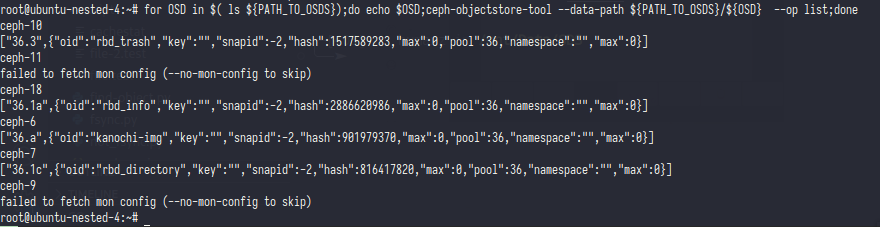
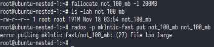
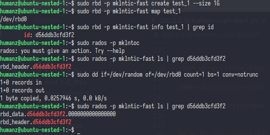
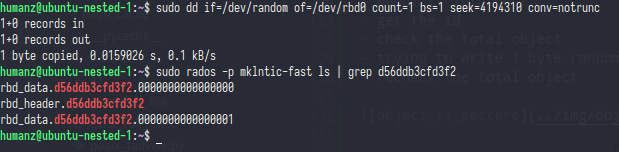
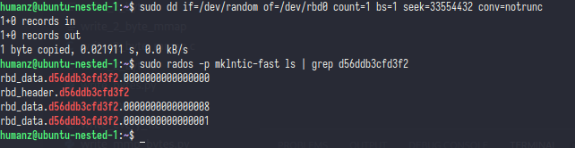

# Object
if you look at [wikipedia](https://en.wikipedia.org/wiki/Ceph_(software)) ceph was storage based on object,but whats is actually object?


In ceph [academic paper](https://ceph.com/assets/pdfs/weil-rados-pdsw07.pdf) they said *object interface in which byte extents can be read or written (much like a file), as that was our initial requirement for Ceph. Data objects are replicated n ways across multiple OSDs to protect against node failures*

### So object is a file in osds and that file was come from files i uploaded into ceph (?)


>yes object was file who come from uploaded file into ceph,but at some reason ceph creating object it's self

#### PoC
First i will upload my waifu image into ceph
- `wget https://yt3.ggpht.com/bUYVctKipBcHzQecsKgc_1cX6_aKRLlwGVUv912mc0xp4zHDAjQDKOrY-wApzj_XPpN0F6-oHX4=s800-c-k-c0x00ffffff-no-rj -O kanochi.jpg`
- `rados -p mklntic put kanochi-img kanochi.jpg`
- `rados -p mklntic ls`


the file was already uploaded into ceph with name kanochi-img,now i'm trying to verify that file.


- `rados -p mklntic get kanochi-img - | md5sum`
- `md5sum kanochi.jpg`

from the md5sum the object and file have same digiset


Now statment no 1 was valid,but how about statment no 2? what's the meaning ceph creating the object by ceph it's self?

Before i trying to proof statment no 2 better i showing proof the statment from ceph academic paper *Data objects are replicated n ways across multiple OSDs to protect against node failures*

Remember when i'm creating the ceph crush rule & ceph pool? if you forget it or not yet read it them GO TO [INIT_CEPH.md](../Init_ceph.md).

in that step i'm creating some crush rule with rack as replication/domain failure, after that i'm create the pool and set the size of pool.  
that size was size of object replication, if i'm set it into 3 that meaning our object will copy into 3 osds with **diffrent rack** because i'm create crush rule with rack as replication/domain failure **(keep in mind)** 

#### PoC
before doing the PoC pls back to [Topology](../Topology.md) and see the **osds tree**

in that osds tree i have 3 rack and earch rack have 3 hosts,2 hosts for have hdd_v2 and 1 hosts for ssd_v2.

And remember i'm put the file in mklntic pool which the file will saved into hdd_v2, ok now start the PoC

```
 -9           4.06847      rack rack01
 -3           0.04887          host ubuntu-nested-1
  0  hdd_v2   0.00980              osd.0                 up   1.00000  1.00000
  1  hdd_v2   0.00980              osd.1                 up   1.00000  1.00000
  8  hdd_v2   0.00980              osd.8                 up   1.00000  1.00000
 20  hdd_v2   0.01949              osd.20                up   1.00000  1.00000
-17           4.00000          host ubuntu-nested-4
  6  hdd_v2   1.00000              osd.6                 up   1.00000  1.00000
  7  hdd_v2   1.00000              osd.7                 up   1.00000  1.00000
 10  hdd_v2   1.00000              osd.10                up   1.00000  1.00000
 18  hdd_v2   1.00000              osd.18                up   1.00000  1.00000
```
osds should be stoped on this host
- `systemctl stop ceph-osd.target`
- `PATH_TO_OSDS=/var/lib/ceph/osd/`
- `for OSD in $( ls ${PATH_TO_OSDS});do echo $OSD;ceph-objectstore-tool --data-path ${PATH_TO_OSDS}/${OSD}  --op list;done`

>i think the object was not in this host,so trying to search it into next host


>the object was in the next host with osd 6 and pg 36.a



>before i'm searching the object in another rack&host better verify the digiset of object.


>and yes,the digiset of object was same


Now in diffrent rack
```
-10           4.06357      rack rack02
 -5           0.04398          host ubuntu-nested-2
  2  hdd_v2   0.00980              osd.2                 up   1.00000  1.00000
  3  hdd_v2   0.00980              osd.3                 up   1.00000  1.00000
  9  hdd_v2   0.00980              osd.9                 up   1.00000  1.00000
 22  hdd_v2   0.01459              osd.22                up   1.00000  1.00000
-28           4.00000          host ubuntu-nested-5
 12  hdd_v2   1.00000              osd.12                up   1.00000  1.00000
 13  hdd_v2   1.00000              osd.13                up   1.00000  1.00000
 14  hdd_v2   1.00000              osd.14                up   1.00000  1.00000
 21  hdd_v2   1.00000              osd.21                up   1.00000  1.00000
```

>And bingo,the object was found on **ubuntu-nested-5**


>object digiset was same with the original


Now back to second statement

### What's the meaning of "ceph creating object it's self" ?
The reason is ...........  
limit size of ceph object, in ceph the maximum size of object is only 100MB you can't upload file more than 100MB in ceph cluster through rados



>So how to solve this problem?

hemm,i don't think that was a problem,i think that was the main design of ceph itself (ceph was storage based on object)

butt if you ask "how to upload file more than 100MB" then the answer is "you can use ceph image"

>If the maximum size of object is 100MB then how the ceph image works? is the ceph will split the file?

Almost,yes the ceph will split your files into objects.

buttttttttt ceph splitting your files has depends on your filesystem,ceph object was acting like block sector so you can write a file in sector XXX,the object not always append like array

here was study case 

- create a simple ceph image
- mount it into host
- get the id
- check the total object
- trying to write 1 byte random into ceph image  
- recheck the total object




as you can see new object was appeared with hex 0 because i didn't define the block sector, now let's define the block sector



i use `seek=4194310` because the size of object was 4194304 (4MB) so 4194310 will over limit the first object 


Ceph will creating new object even the size of first object not filled yet that all because i write bytes in specific block sector

if i tried to write with big sector this will happen




